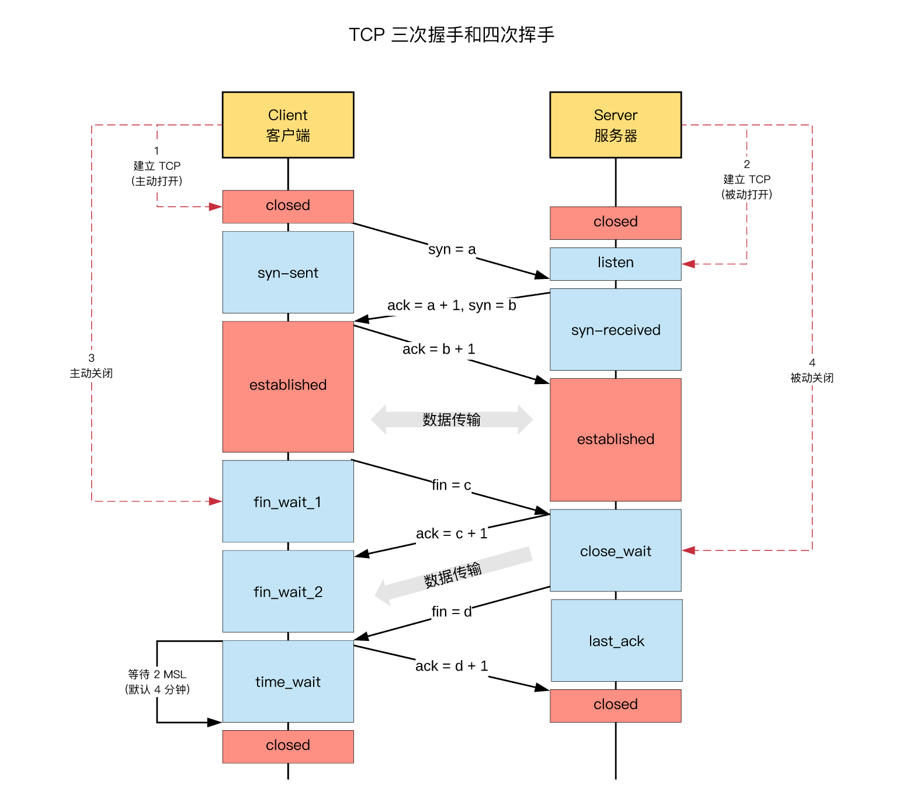

tcp TIMEWAIT 的影响

### 出现原因

大量的 TIME_WAIT 状态 TCP 连接存在，其本质原因是什么？

- 大量的短连接存在
- 特别是 HTTP 请求中，如果 connection 头部取值被设置为 close 时，基本都由「服务端」发起主动关闭连接
- 而，TCP 四次挥手关闭连接机制中，为了保证 ACK 重发和丢弃延迟数据，设置 time_wait 为 2 倍的 MSL（报文最大存活时间）

TIME_WAIT 状态：

- TCP 连接中，**主动关闭**连接的一方出现的状态；（收到 FIN 命令，进入 TIME_WAIT 状态，并返回 ACK 命令）
- 保持 2 个 MSL 时间，即，4 分钟；（MSL 为 2 分钟）

#### 对客户端影响

客户端主动关闭连接。
1。time_wait 状态下，TCP 连接占用的端口，无法被再次使用
2。TCP 端口数量，上限是 6.5w（65535，16 bit）
3。大量 time_wait 状态存在，会导致新建 TCP 连接会出错，address already in use : connect 异常

同时会受文件描述符fd的影响，但最大只能使用 65535（端口影响） 个连接。


#### 对服务器影响

服务器主动关闭连接。

主要受限条件是文件描述符数量。（服务器端复用listen端口，对每一个连接使用一个描述符）
文件描述符只有在从TIME_WAIT状态转换到CLOSE状态后才会真正被系统收回，而关闭的连接处于TIME_WAIT状态导致文件描述符并没有被真正释放。

### 相关资料

#### 查询 TCP 连接状态

```
// Mac 下，查询 TCP 连接状态
$ netstat -nat |grep TIME_WAIT
​
// Mac 下，查询 TCP 连接状态，其中 -E 表示 grep 或的匹配逻辑
$ netstat -nat | grep -E "TIME_WAIT|Local Address"
Proto Recv-Q Send-Q  Local Address          Foreign Address        (state)
tcp4       0      0  127.0.0.1.1080         127.0.0.1.59061        TIME_WAIT
​
// 统计：各种连接的数量
$ netstat -n | awk '/^tcp/ {++S[$NF]} END {for(a in S) print a, S[a]}'
ESTABLISHED 1154
TIME_WAIT 1645

```

#### MSL时间

MSL，Maximum Segment Lifetime，“报文最大生存时间”，

任何报文在网络上存在的最长时间，超过这个时间报文将被丢弃。（IP 报文）
TCP报文 （segment）是ip数据报（datagram）的数据部分。

`RFC 793中规定MSL为2分钟，实际应用中常用的是30秒，1分钟和2分钟等.`

2MSL，TCP 的 TIME_WAIT 状态，也称为2MSL等待状态：

1. 当TCP的一端发起主动关闭（收到 FIN 请求），在发出最后一个ACK 响应后，即第3次握 手完成后，发送了第四次握手的ACK包后，就进入了TIME_WAIT状态。
2. 必须在此状态上停留两倍的MSL时间，等待2MSL时间主要目的是怕最后一个 ACK包对方没收到，那么对方在超时后将重发第三次握手的FIN包，主动关闭端接到重发的FIN包后，可以再发一个ACK应答包。
3. 在 TIME_WAIT 状态时，两端的端口不能使用，要等到2MSL时间结束，才可继续使用。（IP 层）
4. 当连接处于2MSL等待阶段时，任何迟到的报文段都将被丢弃。

不过在实际应用中，可以通过设置 「SO_REUSEADDR选项」，达到不必等待2MSL时间结束，即可使用被占用的端口。

#### TCP 三次握手和四次握手



### QA

#### time_wait 是「服务器端」的状态？or 「客户端」的状态？
1. time_wait 是「主动关闭 TCP 连接」一方的状态，可能是「客服端」的，也可能是「服务器端」的
2. 一般情况下，都是「客户端」所处的状态；「服务器端」一般设置「不主动关闭连接」
 
#### 服务器在对外服务时，是「客户端」发起的断开连接？还是「服务器」发起的断开连接？
1. 正常情况下，都是「客户端」发起的断开连接
2. 服务器」一般设置为「不主动关闭连接」，服务器通常执行「被动关闭」
3. 但 HTTP 请求中，http 头部 connection 参数，可能设置为 close，则，服务端处理完请求会主动关闭 TCP 连接

#### 关于 HTTP 请求中，设置的主动关闭 TCP 连接的机制：TIME_WAIT的是主动断开方才会出现的，所以主动断开方是服务端？

答案是是的。
1. 在HTTP1.1协议中，有个 Connection 头，Connection有两个值，close和keep-alive，这个头就相当于客户端告诉服务端，服务端你执行完成请求之后，是关闭连接还是保持连接，保持连接就意味着在保持连接期间，只能由客户端主动断开连接。还有一个keep-alive的头，设置的值就代表了服务端保持连接保持多久。
2. HTTP默认的Connection值为close，那么就意味着关闭请求的一方几乎都会是由服务端这边发起的。那么这个服务端产生TIME_WAIT过多的情况就很正常了。
3. 虽然HTTP默认Connection值为close，但是，现在的浏览器发送请求的时候一般都会设置Connection为keep-alive了。所以，也有人说，现在没有必要通过调整参数来使TIME_WAIT降低了。


#### time_wait 的必要性？

TCP 连接建立后，「主动关闭连接」的一端，收到对方的 FIN 请求后，发送 ACK 响应，会处于 time_wait 状态；

1. 可靠的实现 TCP 全双工连接的终止：四次挥手关闭 TCP 连接过程中，最后的 ACK 是由「主动关闭连接」的一端发出的，如果这个 ACK 丢失，则，对方会重发 FIN 请求，
因此，在「主动关闭连接」的一段，需要维护一个 time_wait 状态，处理对方重发的 FIN 请求；
2. 处理延迟到达的报文：由于路由器可能抖动，TCP 报文会延迟到达，为了避免「延迟到达的 TCP 报文」被误认为是「新 TCP 连接」的数据，
则，需要在允许新创建 TCP 连接之前，保持一个不可用的状态，等待所有延迟报文的消失，一般设置为 2 倍的 MSL（报文的最大生存时间），解决「延迟达到的 TCP 报文」问题；

#### fd什么时候释放？

Tcp断开连接时，文件描述符只有在从TIME_WAIT状态转换到CLOSE状态后才会真正被系统收回，而关闭的连接处于TIME_WAIT状态导致文件描述符并没有被真正释放。